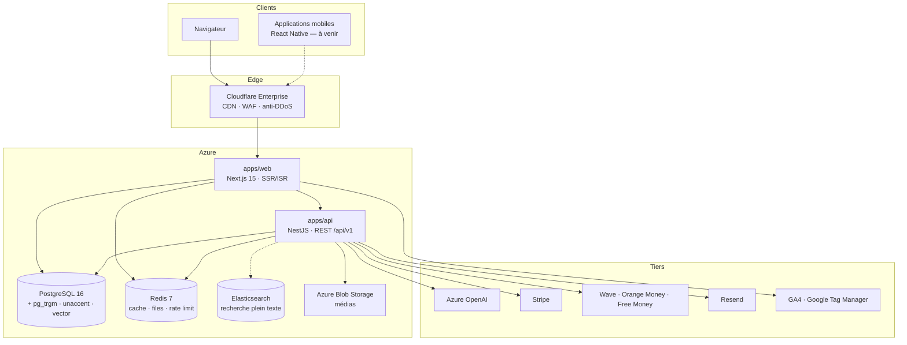

# SENCOURRIER — Architecture technique

> Le média numérique de référence du Sénégal

Ce document décrit l'architecture de la plateforme : découpage applicatif, flux de
données, choix techniques et trajectoire d'évolution.

---

## 1. Vue d'ensemble

SENCOURRIER est un monorepo npm organisé en applications et paquets partagés.

```
sencourrier/
├── apps/
│   ├── web/                     # Next.js 15 (App Router, React 19, TypeScript)
│   └── api/                     # NestJS 11 (REST /api/v1)
├── packages/
│   ├── database/                # Prisma : schéma, migrations, seed
│   ├── config/                  # Marque, URLs canoniques, routes, constantes
│   └── types/                   # Types et contrats partagés
├── infra/docker/                # Dockerfiles, entrypoint, docker-compose
├── scripts/                     # Outils d'exploitation
└── docs/                        # Documentation de conception
```

Le frontend et l'API sont deux services distincts. Le web lit la base en lecture
seule pour le rendu éditorial (latence minimale), l'API porte l'écriture, les
règles métier, l'authentification et l'analytique.

---

## 2. Schéma d'ensemble



---

## 3. Frontend — `apps/web`

| Élément | Choix |
| --- | --- |
| Framework | Next.js 15.5 (App Router) |
| UI | React 19, Tailwind CSS 3.4, composants shadcn/ui |
| Animations | Framer Motion |
| Typographies | Montserrat (titres), Inter (texte), Poppins (accents) |
| Rendu | SSR + `force-dynamic` sur les routes éditoriales, cache CDN |
| Sortie | `output: 'standalone'` (image Docker minimale) |

### Stratégie de rendu

Les pages éditoriales (accueil, rubriques, articles, dernières minutes, tags,
auteurs) sont rendues **à la demande** et mises en cache au niveau du CDN. Ce
choix est délibéré :

- l'actualité change en continu : un rendu figé au moment de la construction de
  l'image servirait du contenu périmé ;
- l'image Docker peut être construite **sans accès à la base**, ce qui est la
  situation normale en CI ;
- le coût d'un rendu serveur est absorbé par Cloudflare, pas par le serveur
  d'origine.

Le shell du site (en-tête, rubriques de navigation, bandeau « dernière minute »)
est protégé par `safeQuery` : si la base est momentanément injoignable, la page
se dégrade (navigation réduite) au lieu de renvoyer une erreur 500.

### Routes principales

| Route | Rôle |
| --- | --- |
| `/` | Une et sections d'actualités |
| `/[category]` · `/[category]/[sub]` | Rubrique et sous-rubrique |
| `/article/[slug]` | Article |
| `/dernieres-minutes` | Fil temps réel |
| `/recherche` | Recherche |
| `/tag/[slug]` · `/journaliste/[slug]` | Tag et page auteur |
| `/tv-live` · `/videos` · `/podcasts` | Formats média |
| `/abonnement` · `/connexion` · `/inscription` · `/profil` · `/tableau-de-bord` | Compte et abonnement |
| `/sitemap.xml` · `/news-sitemap.xml` · `/rss.xml` · `/robots.txt` | SEO et syndication |
| `/api/health` · `/api/contact` · `/api/newsletter/subscribe` | Points d'entrée internes |

---

## 4. Backend — `apps/api`

NestJS 11, API REST versionnée sous `/api/v1`, documentée par Swagger sur
`/api/docs`.

### Modules

| Module | Responsabilité |
| --- | --- |
| `articles` | Cycle de vie éditorial, publication, révisions |
| `categories` · `tags` | Taxonomie |
| `authors` | Profils journalistes |
| `auth` · `users` | Authentification (JWT, OAuth Google, 2FA), profils |
| `search` | Recherche plein texte (trigrammes, accents ignorés) |
| `media` | Médias (Azure Blob Storage) |
| `subscriptions` | Offres, paiements, webhooks |
| `newsletter` | Inscriptions et envois (Resend) |
| `analytics` | Collecte et agrégation (GA4 côté client) |
| `contact` | Formulaire de contact |
| `scheduler` | Publications planifiées, agrégations nocturnes |
| `health` | Sonde de disponibilité |

### Sécurité

JWT à double jeton (accès court + rafraîchissement), 2FA (TOTP), hachage
Argon2, limitation de débit (Redis), en-têtes Helmet, validation stricte des
entrées (Zod/class-validator), journal d'audit (`AuditLog`).

---

## 5. Recherche éditoriale

La recherche est **insensible aux accents** : « Senegal » trouve « Sénégal ».

PostgreSQL ne sait pas indexer directement `unaccent()` (fonction `STABLE`).
La migration `20260930200000_editorial_search_indexes` crée donc un emballage
`IMMUTABLE` :

```sql
CREATE OR REPLACE FUNCTION public.sencourrier_unaccent(text)
RETURNS text LANGUAGE sql IMMUTABLE PARALLEL SAFE STRICT AS
$$ SELECT public.unaccent('public.unaccent', $1) $$;
```

Index GIN trigrammes sur l'expression normalisée :

```sql
CREATE INDEX articles_title_unaccent_trgm_idx
  ON "Article" USING gin (lower(public.sencourrier_unaccent(title)) gin_trgm_ops);
```

Les requêtes utilisent exactement la même expression, ce qui garantit que
l'index est effectivement employé (plan `Bitmap Index Scan` vérifié).

---

## 6. Données

- **PostgreSQL 16** (`pgvector/pgvector:pg16`) : source de vérité.
  Extensions `pg_trgm`, `unaccent`, `vector`.
- **Redis 7** : cache applicatif, limitation de débit, files d'attente légères.
- **Elasticsearch** : prévu pour la recherche à grande échelle (filtres à
  facettes, suggestions, pertinence fine) au-delà de quelques millions
  d'articles.
- **Azure Blob Storage** : images, vidéos, audio (podcasts).

Le modèle de données est décrit dans [`../database/README.md`](../database/README.md).

---

## 7. Infrastructure et exploitation

- **Docker** : `infra/docker/Dockerfile.api`, `Dockerfile.web`,
  `docker-compose.yml`.
- **CI/CD** : GitHub Actions — `.github/workflows/ci.yml` (qualité) et
  `cd.yml` (livraison).
- **Hébergement** : Microsoft Azure (App Service ou Container Apps), CDN
  Cloudflare Enterprise.
- **Observabilité** : journaux structurés, sondes `/api/v1/health`, métriques
  applicatives.

Détails : [`../exploitation/README.md`](../exploitation/README.md).

---

## 8. Évolutions prévues

| Horizon | Objectif |
| --- | --- |
| Court terme | Assistant IA (RAG sur Azure OpenAI), podcasts premium |
| Moyen terme | Applications mobiles React Native (Android/iOS), TV numérique |
| Long terme | Média panafricain multi-pays, rédaction distribuée |

Le socle est dimensionné pour plus d'un million de visiteurs mensuels : le
rendu est statique ou mis en cache au bord, la base est répliquée en lecture,
et les médias sont servis par un CDN.
