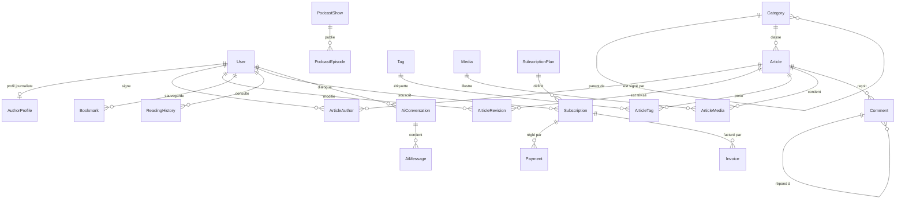

# SENCOURRIER — Modèle de données

Base : **PostgreSQL 16** (`pgvector/pgvector:pg16`), accès via **Prisma 6.19.3**.
Schéma source : `packages/database/prisma/schema.prisma` (47 modèles, 16 énumérations).

---

## 1. Extensions PostgreSQL

| Extension | Usage |
| --- | --- |
| `pg_trgm` | Recherche approximative et index trigrammes |
| `unaccent` | Recherche insensible aux accents |
| `vector` | Embeddings pour l'assistant IA (RAG) |

Ces extensions sont créées par la migration `20260930200000_editorial_search_indexes`,
qui installe également l'emballage `IMMUTABLE` `sencourrier_unaccent(text)`
nécessaire à l'indexation (voir [`../architecture/README.md`](../architecture/README.md)).

---

## 2. Domaines fonctionnels

### Identité et accès

| Modèle | Rôle |
| --- | --- |
| `User` | Compte : identité, rôle, état d'abonnement |
| `Account` · `Session` · `VerificationToken` | Interopérabilité NextAuth |
| `RefreshToken` | Jetons de rafraîchissement (empreinte stockée) |
| `TwoFactorSecret` | 2FA TOTP et codes de secours |
| `UserPreference` | Thème, alertes, préférences éditoriales |

Rôles (`Role`) : `SUPER_ADMIN`, `PUBLISHER`, `EDITOR_IN_CHIEF`, `JOURNALIST`,
`CORRESPONDENT`, `COMMUNITY_MANAGER`, `PREMIUM_SUBSCRIBER`, `READER`.

### Contenu éditorial

| Modèle | Rôle |
| --- | --- |
| `Article` | Article : titre, chapô, corps, SEO, statut, planification |
| `ArticleAuthor` | Signature(s) d'un article, avec position |
| `ArticleRevision` | Historique des modifications |
| `ArticleRelation` | Articles liés, avec score de similarité |
| `LiveBlogEntry` | Direct minute par minute |
| `Media` · `ArticleMedia` | Médias et leur rattachement |

Statuts (`ArticleStatus`) : brouillon, relecture, planifié, publié, archivé.
Formats (`ArticleFormat`) : article, direct, dossier, analyse, brève.

### Taxonomie

| Modèle | Rôle |
| --- | --- |
| `Category` | Rubrique et sous-rubrique (arborescence auto-référencée) |
| `Tag` | Mot-clé, avec compteur d'usage |

### Média

| Modèle | Rôle |
| --- | --- |
| `Video` | Vidéo (TV, reportages) |
| `PodcastShow` · `PodcastEpisode` | Émissions et épisodes |

### Engagement lecteur

| Modèle | Rôle |
| --- | --- |
| `Comment` · `CommentModeration` | Commentaires et modération |
| `Bookmark` | Articles sauvegardés |
| `ReadingHistory` | Historique de lecture et progression |
| `ReadingList` · `ReadingListItem` | Listes de lecture |
| `Notification` · `PushSubscription` | Notifications in-app et Web Push |
| `NewsletterSubscriber` | Abonnés newsletter |

### Abonnement et monétisation

| Modèle | Rôle |
| --- | --- |
| `SubscriptionPlan` | Offres (gratuit, premium) |
| `Subscription` | Abonnement d'un utilisateur |
| `Payment` · `Invoice` | Paiements et factures |
| `AdSlot` | Espaces publicitaires |
| `SponsoredContent` | Articles sponsorisés |
| `AffiliateLink` | Liens d'affiliation |

Fournisseurs de paiement (`PaymentProvider`) : Stripe, Wave, Orange Money,
Free Money.

### Analytique et IA

| Modèle | Rôle |
| --- | --- |
| `PageViewEvent` | Événement de page vue |
| `DailyMetric` | Agrégats journaliers |
| `SearchQueryLog` | Requêtes de recherche |
| `AiConversation` · `AiMessage` | Assistant IA |
| `AiEmbedding` | Segments vectorisés (RAG) |

### Exploitation

| Modèle | Rôle |
| --- | --- |
| `AuditLog` | Journal d'audit |
| `Setting` | Réglages applicatifs |
| `Redirect` | Redirections SEO (301/302) |
| `ContactMessage` | Messages du formulaire de contact |

---

## 3. Relations principales

---

## 4. Index notables

| Index | Objet |
| --- | --- |
| `articles_title_unaccent_trgm_idx` | Recherche par titre, accents ignorés |
| `articles_excerpt_unaccent_trgm_idx` | Recherche par chapô |
| `tags_name_unaccent_trgm_idx` | Recherche par tag |
| Index uniques sur `slug` | URLs canoniques stables |
| Index sur `(status, publishedAt)` | Fils « dernières minutes » |

Tous les index d'expression portent sur `lower(public.sencourrier_unaccent(col))`,
expression strictement identique à celle des requêtes de recherche.

---

## 5. Cycle de vie des données

- **Migrations** : versionnées dans `packages/database/prisma/migrations`,
  appliquées automatiquement au démarrage de l'API (`entrypoint-api.sh`).
- **Sauvegardes** : instantanés automatiques PostgreSQL, restauration à un
  instant précis (PITR).
- **Rétention** : les événements analytiques bruts sont agrégés dans
  `DailyMetric` puis purgés selon la politique de rétention.
- **Conformité** : suppression en cascade sur les données personnelles ;
  journal d'audit conservé séparément.
