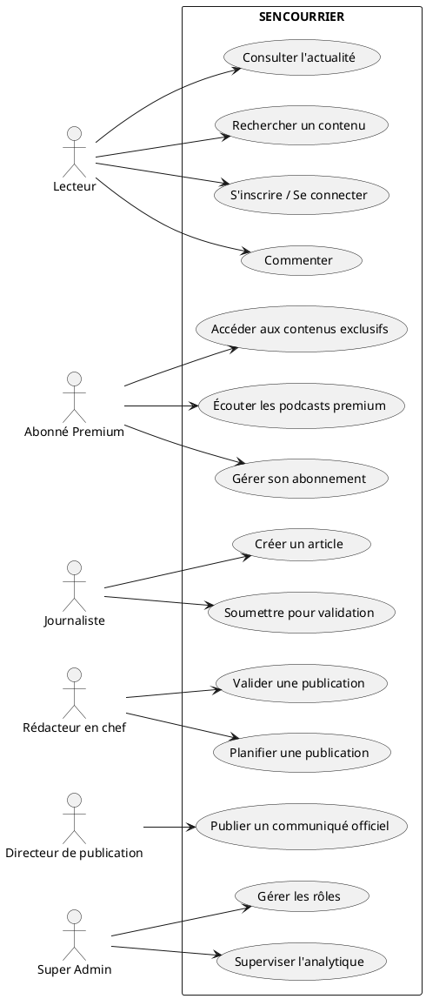
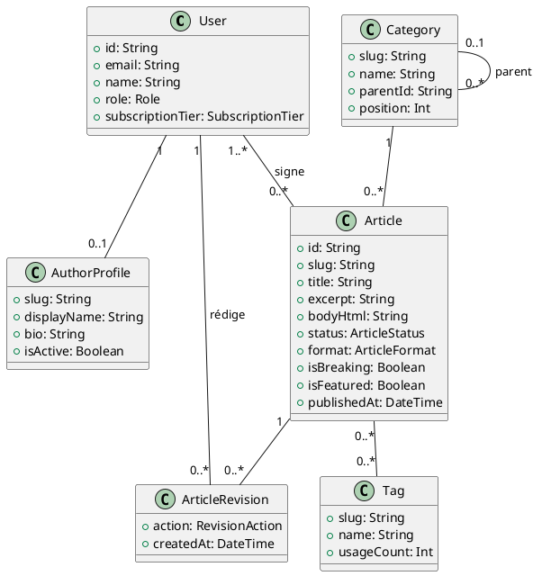
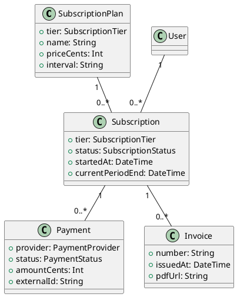
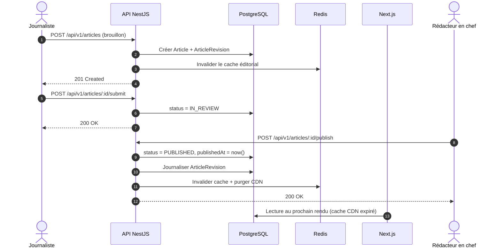
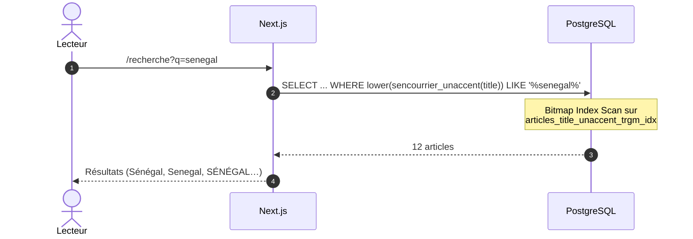
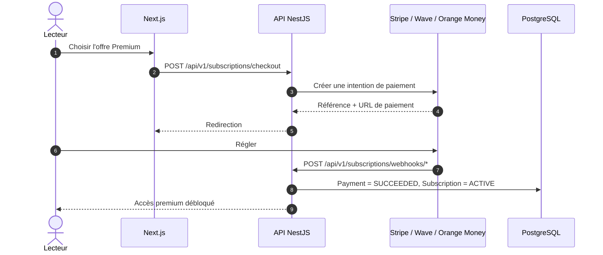
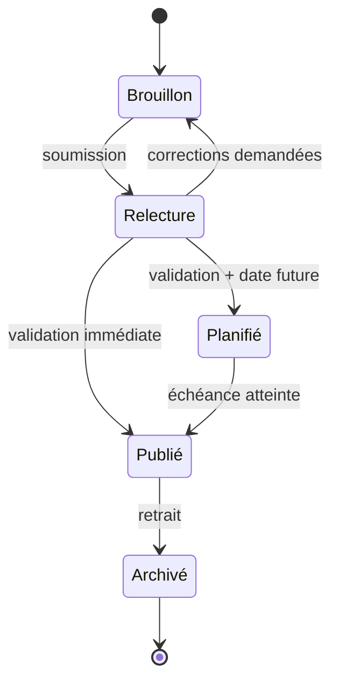
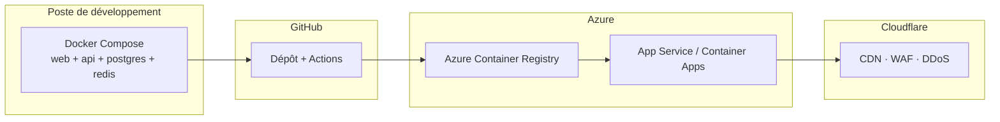

# SENCOURRIER — Schémas UML

Diagrammes de conception. Les sources sont en **Mermaid** (rendus directement
par GitHub) et en **PlantUML** (fichiers `.puml` du même dossier) pour les
diagrammes de classes et de cas d'utilisation.

---

## 1. Cas d'utilisation

---

## 2. Diagramme de classes — noyau éditorial

---

## 3. Diagramme de classes — abonnement

---

## 4. Séquence — publication d'un article

---

## 5. Séquence — recherche insensible aux accents

---

## 6. Séquence — abonnement premium

---

## 7. Activité — cycle de vie éditorial

---

## 8. Déploiement

